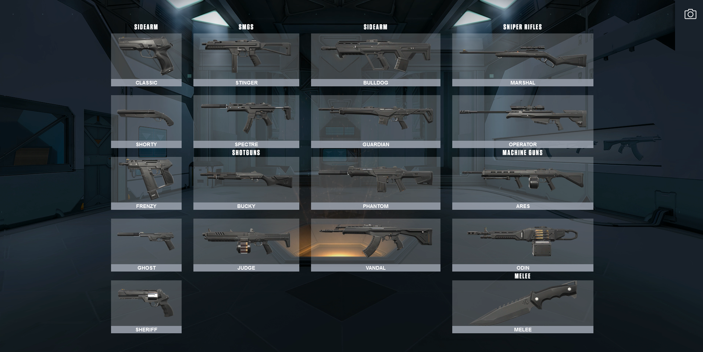
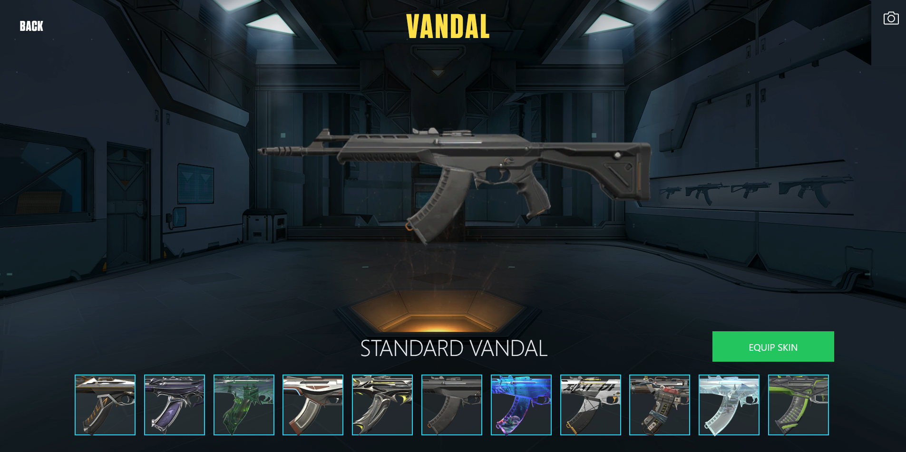

# Wordle clone on VueJS!

## 👀 Project Overview

- 😎 A webapp that tries to work as valorant collection and skin changer, the idea is to select yours favorite skins or current arsenal and download the image(camera button) to share with friends!
- 👨‍💻 Uses React and NextJS to create the ui. Fetches data from the Valorant-API (link below). Uses redux to maintain state of the equiped skins. SwiperJS helps to make the slider to select skins.
- 🔗 You can find this project live on: https://valorant-arsenal-next.vercel.app/.

## 🔥 Techs used

<div style="
    display: inline-block
">
    
    
    
    
    
</div>

## 🔧 Build Setup

```bash
# install dependencies
$ npm install || yarn

# server with hot reload at localhost:3000
$ npm run dev || yarn dev

# build for production
$ npm run build || yarn build

# run the serverside app
$ npm run start || yarn start

```

## 📷 Project images





## 👽 External links

- 🔗 Valorant API(non-official): https://valorant-api.com/
- 🔗 SwiperJS: https://swiperjs.com/

## Other resources: 

- 🔗 HTML to image package Github: https://github.com/bubkoo/html-to-image
- 🔗 FileServer package Github: https://github.com/eligrey/FileSaver.js
- 🔗 Valorant, why not: https://playvalorant.com/